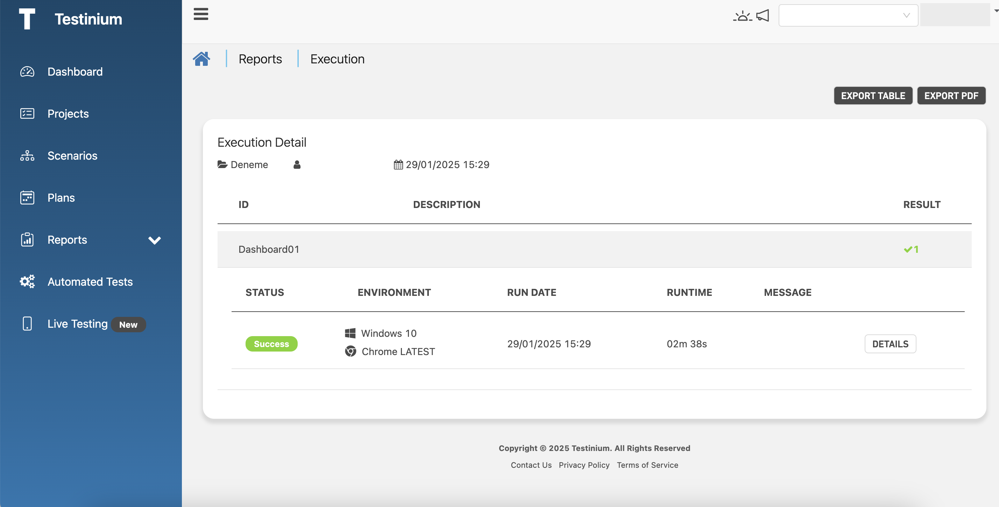

# Report

_**Report**_ redirects to the Test Execution List (Automatic) screen for the selected test plan. Test results of the related plan are displayed on the screen.

1. Click the _**Report.**_

<figure><figcaption></figcaption></figure>

2. Information (status, run date, message, etc.) about the test result is displayed on the screen.

<figure><figcaption></figcaption></figure>
