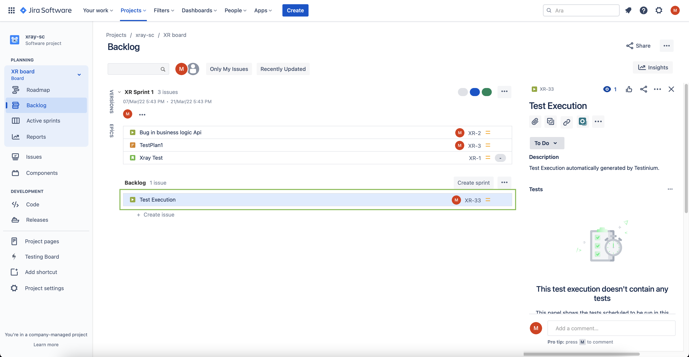

# Xray

With the Xray plugin in Testinium Cloud, You can create test executions automatically. In this document, you will find a step by step description on how to use Xray Plugin in Testinium.

Once you open the dashboard,

* First of, select the Account Information option from menu on the right.

* Click on PLUGINS.

* Click on the Edit button for Xray plugin.

* On the Plugin Page, enter your server url, username and API key for your Xray account. Then click Save.

To create an Xray API key, you need to login from the link below.\
[https://id.atlassian.com/manage-profile/security/api-tokens](https://id.atlassian.com/manage-profile/security/api-tokens)

You can create API key with Create API Token on the page that opens after login.

.png>)

* After filling the required fields and saving, you determine to whom the executed task will be assigned. For that, navigate to the PROJECTS page from the left top corner in the dashboard. Then select the SUMMARY option for your project.

.png>)

* Select ADVANCED option.

* Select XRAY from the tab that opens on the screen.

* Set Enabled in XRAY tab and fill in necessary fields. Then, click SAVE.

* You can see on the Jira board that the executed task is assigned to the relevant user.

