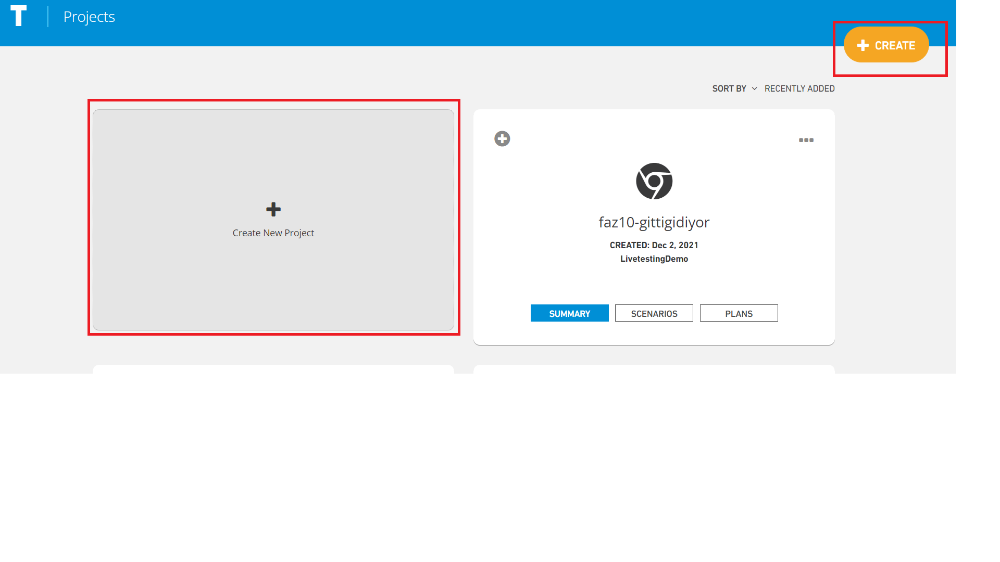

# Create New Project

When the Create and Create New Project button is clicked, you will be directed to the creation screen of the project to be uploaded to the system.

**If the choice is Selenium;**

On the pop-up screen;

_1. Test Framework_

_2. Test File Type_

_3. Test Runner Tool_

_4. Project Name_

_5. GIT Project Folder Name (This is where the test codes are located)_

**Create From Template;** We'll create a sample web project based on a url give.The desired url address is entered in the relevant field.

These values are entered and the Save button is clicked. The system saves the new project

definition. If the Cancel button is clicked, the system cancels the new Project definition process.

On the pop-up screen;

**If the choice is Appium;**

\_\_

_1.Test Framework_

_2.Test File Type_

_3.Project Name_

_4.GIT Project Folder Name_

_5.IOS Mobile App_

_6.Android Mobile App_

**Create From Template;** We'll create a sample web project based on a url give.The desired url address is entered in the relevant field.

These values are entered and the Save button is clicked. The system saves the new project definition. If the Cancel button is clicked, the system cancels the new project definition process.

**If the choice is Service;**

On the pop-up screen;

_1. Test Framework_

_2. Test File Type_

_3. Test Runner Tool_

_4. Project Name_

_5. GIT Project Folder Name (This is where the test codes are located)_

**Create From Template;** We'll create a sample web project based on a url give.The desired url address is entered in the relevant field.

These values are entered and the Save button is clicked. The system saves the new project definition. If the Cancel button is clicked, the system cancels the new Project definition process.

After the project is created, an access token must be created for the account to pull the git code of the Testinium.io project.&#x20;

Access token is created from page [https://git.testinium.io/-/profile/personal\_access\_tokens](https://git.testinium.io/-/profile/personal\_access\_tokens)

For example:

username: demouser\
repo: https://git.testinium.io/\_demouser/demo-project.git \
access token: AAAAAAAAAAA

It can be pulled to the local with the \
**git clone https://demouser@git.testinium.io/\_demouser/demo-project.git** \
command.

Access token value (AAAAAAAAAAA) is written in the password field.

After the project is updated, it can be pushed with basic git commands.
