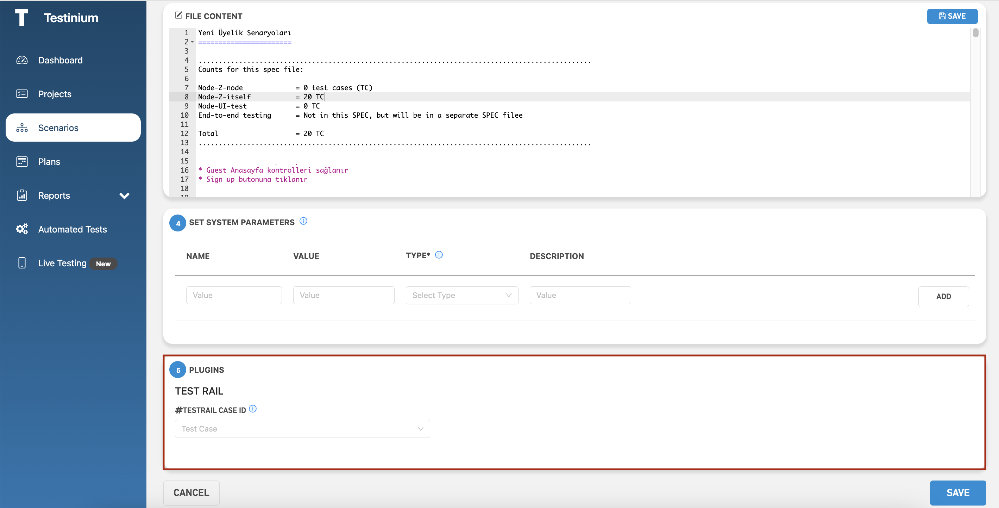

# Create Scenario

_**Create New Scenarios;**_ it is the screen where a new scenario definition is made in the system. Before this process, Project Name must be selected on the listing screen. Otherwise, the system gives an error message that the new scenario operation cannot be performed without selecting a project name. The system also applies filtering on the listing screen according to the selected project name.

The following steps should be followed to create a new scenario;

1. Click the _**Create New Scenario**_ on the Scenarios screen.

<figure><figcaption></figcaption></figure>

2. Enter the properties of the scenario to be created from the _**Properties**_**.**

* _**Select A Project;**_ allows you to select the project or one of the projects you have created.
* _**Scenario Name;**_ this is the field where you will give the name of the scenario you will create.
* _**Description;**_ this is the field where you can add a description about the scenario.
* _**Group;**_ you can group multiple scenarios under a group name
* _**Max Execution Time;**_ If a test run within this time limit, it will be cancelled.

<figure><figcaption></figcaption></figure>

3. Select the file to be used from the _**Select Source File**_ field where the test files of the selected project are listed.

<figure><figcaption></figcaption></figure>

4. Select the methods listed for the file selected from the _**Select Test Method**_ field.

* _**Create Scenario Group;**_ you can select multiple scenarios and name the group like a scenario as what you type in SCENARIO NAME field on left.update the source codes of the selected file from the File Content field in case of need

<figure><figcaption></figcaption></figure>

5. a. Update the source codes of the selected file from the _**File Content**_ field in case of need.

&#x20;      b. Click the _**Save**_ button after the change.

<figure><figcaption></figcaption></figure>

&#x20;6\.  a. Enter the following parameters and set them in the _**Set System Parameters**_ field;

* Name
* Value
* Description

&#x20;   b. Click the _**Add**_ button to set parameters

<figure><figcaption></figcaption></figure>

7. Configure plugin settings in the _**Plugins**_ field.

* The plugins activated for the project to which the scenario belongs are included in this field. If there is no plugin activated for the project, this field is not included in the scenario creation screen.

<figure><figcaption></figcaption></figure>

7. a. Click to _**Save**_ to save the new scenario to the system.

&#x20;     b. Click to _**Cancel**_ to cancel the scenario definition process.
