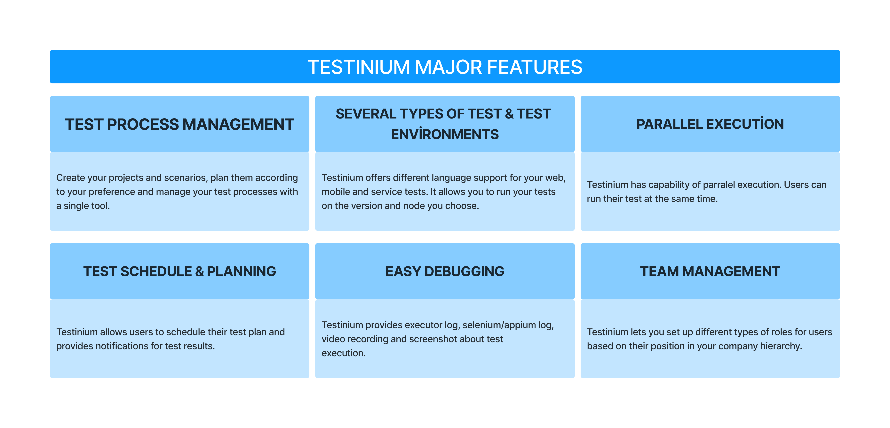

# What is Testinium?

Testinium is a test automation tool which allows its users to orchestrate their testing process.

It is a tool that gathers all test automation proccess under a single roof.

<figure><figcaption></figcaption></figure>

