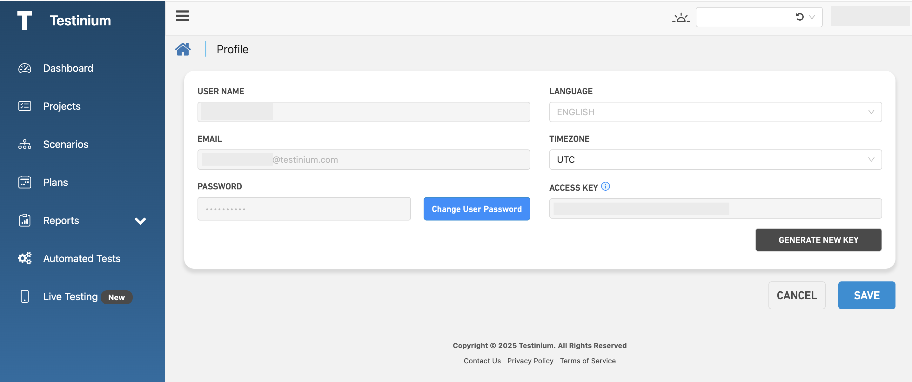

# User Profile

_**Profile;**_ it is the screen where the user who logs in to the system can display and change his/her profile information.

1. Click the _**Profile**_ under the username.
2. The following information is displayed or updated;

* _**Username;**_ required for the system
* _**Email;**_ the e-mail address used to login to the system
* _**Password;**_ it used to login to the system
* _**Language;**_ option of the system to be used
* _**Timezone;**_ the time zone in which the system is intended to be used
* _**Access Key;**_ it is the key value that the testinium product uses to identify each user.
* _**Change User Password;**_ button to change user password.
* _**Generate New Key;**_ only the Access Key value can be changed from these values, and for this, the Generate New Key button is pressed. After the change, the Save button is clicked and the data is saved.

<figure><figcaption></figcaption></figure>

3. a. Click _**Save**_**,** to save the changes made on the User Profile screen.

&#x20;      b. Click _**Cancel**_**,** to cancel changes made on the User Profile screen.
